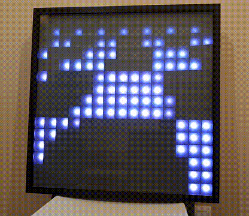

# tixy.land LED display

[tixy.land](https://tixy.land) is a minimalist creative coding environment created by [Martin Kleppe @aemkei](https://twitter.com/aemkei). I just had to port it to my 15x15 Arduino powered LED matrix.

All the code is open-source. If you'd like to see you creation on the matrix open a pull-request and I'll make it happen.

## Tixy.land display

  
More animations by [Paul Malin @P_Malin](https://twitter.com/P_Malin/)
